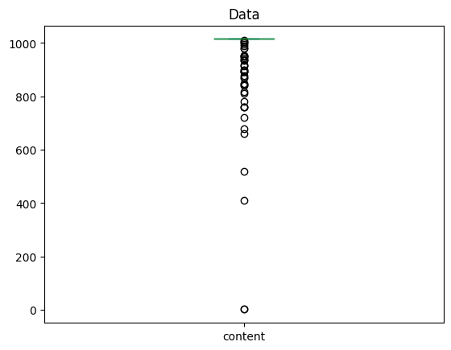
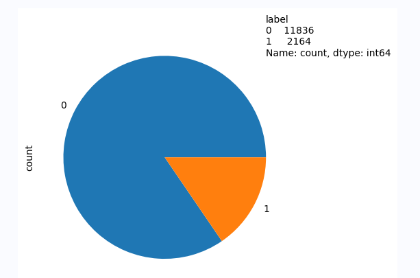

### 深度学习路线

我们居然奇迹般的达到了 $0.9893$ 的惊人成绩，很显然深度学习是个很强大的算法，但是我们要付出巨大的代价。

其实也有继续优化的空间，但是我自己的水平可能不足以让自己继续做下去。

会用到的仓库

```python
import numpy as np # 数值计算
import pandas as pd # 数据分析
from tqdm import tqdm # 进度条显示
import paddle # PaddlePaddle 深度学习框架
from paddlenlp.transformers import AutoModelForSequenceClassification, AutoTokenizer # 飞桨自然语言处理工具包（模型、分词器）
from paddle.io import DataLoader # 数据加载器
from paddlenlp.datasets import MapDataset # 数据集转换
from sklearn.model_selection import train_test_split # 训练集与验证集拆分
import matplotlib.pyplot as plt # 绘图
```

核心在于使用了百度开源的paddle模型，即它的自然语言处理工具包，然后我们剩下的工作就是在调用这些模型来为我们服务。

很显然，现在的模型已经很成熟了，实际开发中还是在当“调包侠”，也许能做的就是尝试更多的模型，比对并选择表现最好的。

同样的，pandas依然被用于读取csv文件。在此之后，我们可以使用可视化技术来查看数据的特性，首先是每个样本的单词长度。

```py
# 句子长度分布图
data['content'].apply(len).plot(kind='box')
plt.title('Data')
```



看上去绝大部分在600-1000词左右，密度最高的在800-1000词的区间，所以我们可以考虑**丢弃一些样本来提高样本纯度**。

字符的长度分布如下所示：

```py
# 句子长度分布数据
data["content"].apply(len).describe()
```

```
count    14000.000000
mean      1014.411857
std         16.114179
min          2.000000
25%       1015.000000
50%       1015.000000
75%       1015.000000
max       1015.000000
Name: content, dtype: float64
```

看起来绝大多数都在1015个词。

但是致命的是，0和1的样本**并不均等**，这会严重影响到模型训练的性能和训练过程，根据某位大佬的回答，应对方法可能有：

    重采样： 通过重采样来平衡训练数据的类别分布。具体来说，可以增加少数类别的样本数（过采样）或减少多数类别的样本数（欠采样）。但需要注意，过度的欠采样可能会导致信息丢失，过度的过采样可能会引入噪声。

    生成人工样本： 对于少数类别，可以使用生成模型（如SMOTE）来生成人工样本，以增加其数量。这有助于增强少数类别的特征表示。

    类别权重调整： 在损失函数中引入类别权重，使得模型更加关注少数类别。常见的方法包括加权交叉熵损失。

    采用不同的评估指标： 在不平衡类别问题中，准确率可能不是一个很好的评估指标，因为它可能受到多数类别的影响较大。可以考虑使用精确度、召回率、F1分数等更适合处理不平衡类别问题的评估指标。

    集成方法： 使用集成方法（如随机森林、XGBoost、AdaBoost等）可以有效地处理不平衡类别问题，因为它们能够对多个模型的预测结果进行组合。

    迁移学习： 利用在其他数据集上预训练的模型，然后在目标数据集上进行微调，可能有助于改善不平衡类别问题。

显然，我们不被允许手动添加数据，因此可能做的是调整权重、采用不同的评估指标或者采用集成方法来解决问题。

```py
# 标签分布图
data["label"].value_counts().plot(kind="pie").text(1, 1, f"{data['label'].value_counts()}")
```



接下来是训练模型，仍然是分训练集和测试集合，训练时会用到GPU，毕竟是深度学习模型。

```py
# 按照 10% 的比例划分训练集与验证集
train_data, valid_data = train_test_split(data, test_size=0.1)

# 下面就是一堆操作，把数据变成数据加载器可以识别的格式，自定义数据集类也是同样的效果
train_dict = train_data.to_dict(orient='records')
valid_dict = valid_data.to_dict(orient='records')
train_ds = MapDataset(train_dict)
valid_ds = MapDataset(valid_dict)

# 将整体数据拆分为 30 份，放入数据加载器，就是一次性会有 <总样本数 / 30> 份数据同时并行计算，份数越多，并行越多，显存占用越大，需要根据需求来选择
train_loader = DataLoader(train_dict, batch_size=30, shuffle=True) # 训练数据可以随机打乱，让模型更好地学习，减轻学习到无关特征的问题
valid_loader = DataLoader(valid_dict, batch_size=30) # 这里用的是 V100 32G，如果是显存更小的卡，需要调小一点，不然会炸显存
```

后面具体训练方式我不太理解，使用了“ernie-3.0-mini-zh 序列分类模型”，但我不知道到底是在做什么？把模型参数设定好就可以开始训练了。

说实话，很多操作都被屏蔽了，只需要做的事情就是调用API，我顶多就不知道掉哪个API而已。

```py
# 载入模型与分词器

# 使用 ernie-3.0-mini-zh 序列分类模型，并将分类类别数设置为 2
model = AutoModelForSequenceClassification.from_pretrained("ernie-3.0-mini-zh", num_classes=2)
# 使用 ernie-3.0-mini-zh 分词器
tokenizer = AutoTokenizer.from_pretrained("ernie-3.0-mini-zh")

# 定义 AdamW 优化器，学习率为 0.000001
optimizer = paddle.optimizer.AdamW(1e-5, parameters=model.parameters())

# 定义损失函数为交叉熵函数，计算每个 mini batch 的均值
loss_fn = paddle.nn.loss.CrossEntropyLoss(reduction='mean')
```

最后是开始训练模型和验证，它花了大概600秒的时间，事实上我也不知道具体代码写的是什么。

但是我认为，只有学会了NLP的原理，我才能知道这些代码到底在写什么？

训练中需要转化成可处理的形式，并且转化成张量才能够并行计算，这是为什么？

反向传播又是什么？并且训练时需要清空梯度，以防残留梯度影响后续训练。
```py
for epoch in range(30): # 训练 30 轮
    # 训练过程
    model.train() # 切换模型为训练模式
    for batch_x in tqdm(train_loader): # 每次从数据加载器读入一批(batch)数据
        X = tokenizer(batch_x["content"], max_length=1015, padding=True) # 将数据转换为模块可处理的数据形式
        input_ids = paddle.to_tensor(X['input_ids'], dtype="int32") # 将 input_ids 变为张量，方便并行计算
        token_type_ids = paddle.to_tensor(X['token_type_ids'], dtype="int32") # 将 token_type_ids 变为张量
        pred = model(input_ids, token_type_ids) # 将数据读入模型，并得到计算后的结果
        loss = loss_fn(pred, paddle.to_tensor(batch_x["label"], dtype="int32")) # 对比预测结果与真实结果，计算损失函数的值
        loss.backward() # 反向传播，计算梯度
        optimizer.step() # 优化器根据梯度与学习率调整模型参数
        optimizer.clear_gradients() # 清空梯度，避免下次梯度计算时累加

    # 验证过程
    model.eval() # 切换模型为验证模式
    val_loss = [] # 验证集数据的损失函数合集
    with paddle.no_grad(): # 在模型验证时，只做前向计算，因此不需要保存梯度信息
        for batch_x in tqdm(valid_loader): # 下面的操作与训练过程相同
            X = tokenizer(batch_x["content"], max_length=1015, padding=True)
            input_ids = paddle.to_tensor(X['input_ids'], dtype="int32")
            token_type_ids = paddle.to_tensor(X['token_type_ids'], dtype="int32")
            pred = model(input_ids, token_type_ids)
            loss = loss_fn(pred, paddle.to_tensor(batch_x["label"], dtype="int32"))
            val_loss.append(loss.item()) # 将计算出的损失函数值存入合集
            
    # 打印本轮训练的验证集损失函数值，与预测正确率
    print('Epoch {0}, Val loss {1:3f}, Val Accuracy {2:3f}'.format(
    epoch,
    np.mean(val_loss), 
    (pred.argmax(1) == batch_x["label"]).astype('float').mean().item()
))
# 保存模型参数
paddle.save(model.state_dict(), "/home/aistudio/work/model.pdparams")
# 保存优化器参数
paddle.save(optimizer.state_dict(), "/home/aistudio/work/optimizer.pdopt")
```

当然训练完成之后保存好已经训练完成的模型，在之后的推理中可以重新利用。
```python
# 如果你拿到了模型参数（在 AIStudio 中提供），你可以运行这行代码，如果直接运行模型，则没有必要运行

# 载入模型参数、优化器参数的最后一个epoch保存的检查点
layer_state_dict = paddle.load("/home/aistudio/work/model.pdparams")
opt_state_dict = paddle.load("/home/aistudio/work/optimizer.pdopt")

# 将加载后的参数与模型关联起来
model.set_state_dict(layer_state_dict)
optimizer.set_state_dict(opt_state_dict)

# 自定义推理函数
def infer(string: str) -> int:
    """将文本传入模型并返回预测结果
    
    输入：
        - string: str
            待预测的文本内容
    
    输出:
        - result: int
            模型的预测结果
    """
    X = tokenizer([string], max_length=1015, padding=True)
    input_ids = paddle.to_tensor(X['input_ids'], dtype="int32")
    token_type_ids = paddle.to_tensor(X['token_type_ids'], dtype="int32")
    pred = model(input_ids, token_type_ids)
    result = pred.argmax(1).item() # 获取预测概率最大的那个类别
    return result
```

获得模型之后就可以开始用来推理了。

```py
test_data["label"] = test_data["content"].apply(infer) # 将测试集的每个文本送入模型返回结果
submit = test_data.drop(columns=["content"]) # 生成提交数据（就是把带结果的测试集丢掉内容，复制一份）
submit.to_csv("submit.csv", index=False) # 保存 CSV 文件
```

这就是使用深度学习去解决NLP问题的方法，整个流程为：

1. 读取训练集和测试集
2. 分析数据寻找特点，可采用可视化方法
3. 划分训练集和测试集，并转化成可处理的数据
4. 载入模型和分词器
5. 开始训练并保存模型，期间可查看训练效果
6. 运行模型开始推理