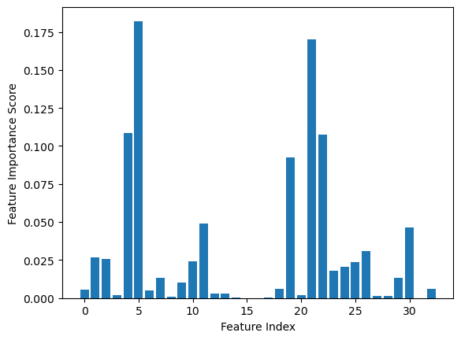
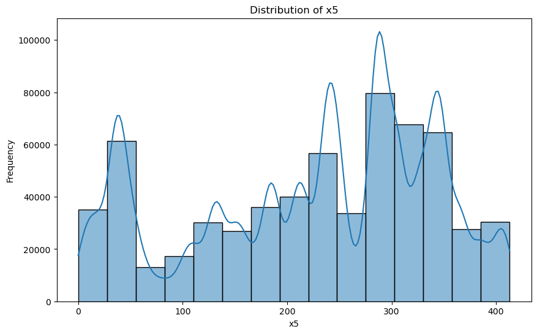
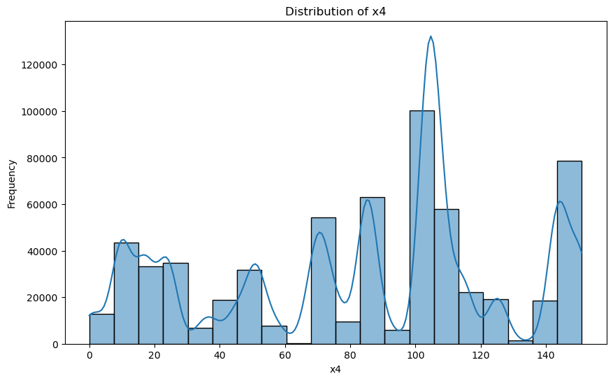

### 模型迭代优化

尽我所能，做到哪里是哪里，继承上一章节，baseline笔记。

#### 特征选择与删除

分析特征的重要性，可以使用特征选择方法（如基于模型的特征重要性）来选择最具有预测能力的特征，也可以删除一些对模型性能影响较小的特征。

因为我们使用的是决策树，所以可以尝试评估一下特征的重要性。

在原有训练模型的语句中追加：

```py
## 对决策树模型进行特征选择和尝试
import matplotlib.pyplot as plt
from sklearn.tree import DecisionTreeClassifier

clf = DecisionTreeClassifier()
clf.fit(
    train_data.drop(['udmap','common_ts','uuid','target'],axis=1),
    train_data['target']
)

# 此后添加
feature_importance_scores = clf.feature_importances_
feature_name = clf.feature_names_in_
plt.bar(range(len(feature_importance_scores)), feature_importance_scores)
plt.xlabel('Feature Index')
plt.ylabel('Feature Importance Score')
plt.show()
```



当然我们可以生成一个表格，查看到底哪些是真正需要的，哪些可以扔掉！

```py
# 创建一个包含特征名字和重要性分数的 DataFrame
feature_importance_df = pd.DataFrame({'Feature': feature_name, 'Importance': feature_importance_scores})

# 按照重要性降序排列
feature_importance_df = feature_importance_df.sort_values(by='Importance', ascending=False)

# 打印生成的表格
print(feature_importance_df)
```

```
    Feature	        Importance
5	x5	            0.182158
21	common_ts_hour	0.169891
4	x4	            0.108740
22	common_ts_day	0.107647
19	eid_mean	    0.092556
11	key3	        0.048935
30	x7_mean	        0.046646
26	x2_mean	        0.030698
1	x1	            0.026537
2	x2	            0.025808
10	key2	        0.024042
25	x2_freq	        0.023700
24	x1_mean	        0.020572
23	x1_freq	        0.017917
7	x7	            0.013566
29	x7_freq	        0.013162
9	key1	        0.010449
--------- drop needed --------
32	x8_mean	        0.006296
18	eid_freq	    0.005885
0	eid	            0.005360
6	x6	            0.004991
13	key5	        0.002977
12	key4	        0.002935
3	x3	            0.002152
20	udmap_isunknown	0.001933
27	x6_freq	        0.001425
28	x6_mean	        0.001424
8	x8	            0.000707
14	key6	        0.000588
17	key9	        0.000230
16	key8	        0.000038
31	x8_freq	        0.000034
15	key7	        0.000001
```

可以暂定drop所有特征在0.010以下的特征，他们的存在只是为了过拟合。

删除这些特征，然后尝试新的代码。

```py
from sklearn.tree import DecisionTreeClassifier

dropped = ['udmap','common_ts','uuid', 'x8_mean','eid_freq'
           ,'eid','x6','key5','key4','x3','udmap_isunknown','x6_freq','x6_mean','x8','key6',
           'key9','key8','x8_freq','key7']
dropped_train = dropped + ['target']

clf = DecisionTreeClassifier()
clf.fit(
    train_data.drop(dropped_train,axis=1),
    train_data['target']
)
DecisionTreeClassifier(ccp_alpha=0.0, class_weight=None, criterion='gini',
                       max_depth=None, max_features=None, max_leaf_nodes=None,
                       min_impurity_decrease=0.0, 
                       min_samples_leaf=1, min_samples_split=2,
                       min_weight_fraction_leaf=0.0,
                       random_state=None, splitter='best')

pd.DataFrame({
    'uuid': test_data['uuid'],
    'target': clf.predict(test_data.drop(dropped,axis=1))
}).to_csv('submit_dropped.csv',index=None)
```

得分是 0.72866，要比**0.73378**低一点，毕竟删除了多余的特征也会让拟合能力下降一些……但是很明显跑的更快了，3.0秒跑完了（我忘了上个跑了多久）

**不！要！删！太！多！别怪我没警告过你！**

#### 特征组合与交互

将不同特征进行组合、相乘、相除等操作，创建新的特征，以捕捉特征之间的复杂关系。

我暂时不知道怎么挖掘，或者怎么做组合？暂时跳过。

#### 数值型特征的分桶（Binning）

将连续的数值型特征划分为多个区间，可以提高模型对特征的鲁棒性。

我们已经知道有些是数值类型的：

数值类型：
- x4
- x5

而x3的表现像是类型，而不是数值，因此无需操作

尤其是该死的x4和x5，相关性还很大！我们必须尝试挖掘。

对于x5，我们可以尝试可视化，然后得出最佳的分桶数据

```py
import pandas as pd
import matplotlib.pyplot as plt
import seaborn as sns

# 读取训练数据
train_data = pd.read_csv('data/用户新增预测挑战赛公开数据/train.csv')

# 假设 'x5' 是要分析的特征
feature_to_analyze = 'x5'

# 绘制直方图
plt.figure(figsize=(10, 6))
sns.histplot(train_data[feature_to_analyze], bins=15, kde=True)
plt.title(f'Distribution of {feature_to_analyze}')
plt.xlabel(feature_to_analyze)
plt.ylabel('Frequency')
plt.show()
```


对于x4是：



初步判断分为20个桶比较合适

开始分桶并进行测试……

```py
### 分桶+交叉验证
from sklearn.preprocessing import KBinsDiscretizer

from sklearn.tree import DecisionTreeClassifier
from sklearn.model_selection import cross_val_predict
from sklearn.metrics import classification_report

# 对照组
pred = cross_val_predict(
    DecisionTreeClassifier(),
    train_data.drop(dropped_train, axis=1),
    train_data['target']
)
print(classification_report(train_data['target'], pred, digits=3))

train_data_B = train_data.copy(deep=True)

# 对x5进行分桶
bin_discretizer = KBinsDiscretizer(n_bins=20, encode='ordinal', strategy='uniform')
numerical_feature_binned = bin_discretizer.fit_transform(train_data_B[['x5']])

train_data_B['x5_binned'] = numerical_feature_binned
# 对x4进行分桶
bin_discretizer = KBinsDiscretizer(n_bins=20, encode='ordinal', strategy='uniform')
numerical_feature_binned = bin_discretizer.fit_transform(train_data_B[['x4']])

train_data_B['x4_binned'] = numerical_feature_binned

# 验证组

pred = cross_val_predict(
    DecisionTreeClassifier(),
    train_data_B.drop(dropped_train+['x4','x5'], axis=1),
    train_data_B['target']
)
print(classification_report(train_data_B['target'], pred, digits=3))
```

验证结果，模型效能有一定的下降，但不同的桶数可能带来不一样的结果，我们想做个新实验。

```
              precision    recall  f1-score   support

           0      0.954     0.950     0.952    533155
           1      0.700     0.720     0.710     87201

    accuracy                          0.917    620356
   macro avg      0.827     0.835     0.831    620356
weighted avg      0.918     0.917     0.918    620356

              precision    recall  f1-score   support

           0      0.952     0.947     0.949    533155
           1      0.686     0.707     0.696     87201

    accuracy                          0.913    620356
   macro avg      0.819     0.827     0.823    620356
weighted avg      0.914     0.913     0.914    620356
```

为方便验证，我们取1行f1-score列，比如第一次对照组是0.710，测试组是0.696

|  分桶次数   | 表现  |
|  ----  | ----  |
|none|0.710|
|10|0.689|
|20|0.696|
|40|0.703|
|80|0.707|
|160|0.709|

我认为40个桶基本上就足够满足要求了，当然拟合表现还是会下降的。

添加并修改以下代码

```py
from sklearn.preprocessing import KBinsDiscretizer
## bin
bin_discretizer = KBinsDiscretizer(n_bins=40, encode='ordinal', strategy='uniform')

numerical_feature_binned = bin_discretizer.fit_transform(train_data[['x5']])
train_data['x5_binned'] = numerical_feature_binned
numerical_feature_binned = bin_discretizer.fit_transform(test_data[['x5']])
test_data['x5_binned'] = numerical_feature_binned

numerical_feature_binned = bin_discretizer.fit_transform(train_data[['x4']])
train_data['x4_binned'] = numerical_feature_binned
numerical_feature_binned = bin_discretizer.fit_transform(test_data[['x4']])
test_data['x4_binned'] = numerical_feature_binned
### bin

dropped = ['udmap','common_ts','uuid', 'x8_mean','eid_freq'
           ,'eid','x6','key5','key4','x3','udmap_isunknown','x6_freq','x6_mean','x8','key6',
           'key9','key8','x8_freq','key7','x4','x5']
dropped_train = dropped + ['target']
```

#### 类别型特征的编码

我们可以尝试用不同的类型编码

可以尝试编码的类型包括

- x1
- x2
- key2
- key3

不同的编码方式效果如下：
- One-Hot 编码： One-Hot 编码是将每个类别转换为一个二进制特征的向量。对于每个类别，都创建一个新的二进制特征列，其中只有一个位置为1，其余位置为0。这种编码方式适用于类别之间没有明显的序关系的情况。
- Label Encoding： Label Encoding 是将每个类别映射到一个整数，从0开始递增。这种编码方式适用于类别之间有一定的序关系，例如大小、优先级等。但要注意，Label Encoding 可能会引入类别之间的偏序关系，有时可能会误导模型。
- Target Encoding： Target Encoding（也称为 Mean Encoding 或 Likelihood Encoding）是一种将类别型特征的每个类别映射到目标变量的均值或其他统计量的编码方式。这种编码方式可以在一定程度上将目标变量的信息嵌入到特征中，从而更好地捕捉类别特征与目标之间的关系。但需要注意，Target Encoding在处理训练数据时可能会引入信息泄露问题，因此在进行交叉验证时要小心使用。

我们暂不清楚应该使用什么编码，唯一可行的方法是全部试一遍，这必然是很费时的事情……

#### 时间特征的挖掘

我们有必要进一步挖掘时间，因为我们发现时间决定的因素太重要了！

已经挖掘的：

- hour
- day

可以继续挖掘的

- 星期几
- 月份
- 分钟
- 是否是双休

继续进行对照试验

```py
# 对照组
pred = cross_val_predict(
    DecisionTreeClassifier(),
    train_data.drop(dropped_train, axis=1),
    train_data['target']
)
print(classification_report(train_data['target'], pred, digits=3))


train_data_B = train_data.copy(deep=True)

# 假设 train_data 是你的训练数据 DataFrame，'common_ts' 是时间戳特征
train_data_B['weekday'] = train_data['common_ts'].dt.weekday  # 星期几，0表示星期一，6表示星期日
train_data_B['month'] = train_data['common_ts'].dt.month  # 月份，1表示一月，12表示十二月
train_data_B['minute'] = train_data['common_ts'].dt.minute  # 分钟
train_data_B['is_weekend'] = train_data['common_ts'].dt.weekday.isin([5, 6])  # 是否是双休，即星期六或星期日
# 验证组

pred = cross_val_predict(
    DecisionTreeClassifier(),
    train_data_B.drop(dropped_train, axis=1),
    train_data_B['target']
)
print(classification_report(train_data_B['target'], pred, digits=3))
```

测试结果表现又下降了 0.003 ，加入一些错误特征会导致拟合效果变差，我们可以尝试一下哪些可以增加表现。

实验结果：

- 星期几 ++
- 月份 ==
- 分钟 --
- 是否是双休 --


经过验证，只有weekday能够有效增加模型表现，其他的新特征只会带来负优化，那么我们添加这个特征吧。

```py
### addition time feature
train_data['weekday'] = train_data['common_ts'].dt.weekday
test_data['weekday'] = test_data['common_ts'].dt.weekday
```

得分是：0.72496，感觉全在做负优化……

#### 特征缩放

特征缩放是一种预处理技术，用于将不同范围或单位的**数值型特征**调整到相似的范围，以便在训练模型时获得更好的性能和效果。在机器学习中，许多模型对于特征的尺度非常敏感，如果不对特征进行适当的缩放，可能会导致模型在训练时收敛困难，影响性能。

可能的做法

- 标准化（Z-score 标准化）： 标准化将特征缩放到均值为0，标准差为1的标准正态分布。这种方法适用于特征的分布接近正态分布，但不受异常值影响。
- 最小-最大缩放： 最小-最大缩放将特征线性缩放到一个特定的范围，通常是 [0, 1]。这对于模型对特征的绝对值范围敏感的情况较为适用。
- 缩放到单位向量： 这种方法将特征向量缩放为单位长度，适用于某些模型（如神经网络）中。

我发现 x4和x5的最小值在个位数，最大值可以达到150和400，应该可以做标准化处理，我觉得可能存在异常值。

根据分桶实验，数据集不符合正态分布的特征，因此无法使用标准化，且这不是神经网络，而是决策树，因此也无法使用单位向量。所以唯一的选择就是最大最小缩放。

那么怎么做呢？

继续实验，但是由于可能会和桶冲突，删除原先桶的代码，然后继续实验。

```py
# 缩放组
from sklearn.preprocessing import MinMaxScaler
scaler = MinMaxScaler()  # 创建最小-最大缩放器
train_data_C = train_data.copy(deep=True)
train_data_C['x4_scaled'] = scaler.fit_transform(train_data[['x4']])
train_data_C['x5_scaled'] = scaler.fit_transform(train_data[['x5']])

pred = cross_val_predict(
    DecisionTreeClassifier(),
    train_data_C.drop(dropped_train+['x4','x5'], axis=1),
    train_data_C['target']
)
print(classification_report(train_data_C['target'], pred, digits=3))
```

|  数据处理   | 表现  |
|  ----  | ----  |
|对照组|0.705|
|分桶|0.700|
|缩放|0.705|

总结，分桶是负优化，缩放做了个寂寞……

但是也有意义，针对数值范围较大的特征，你可以使用最小-最大缩放（Min-Max Scaling）来将其缩放到一个固定的范围，通常是 [0, 1]。这样可以将特征的值映射到一个相对小的区间，从而避免了数值范围过大导致的模型收敛问题。


我们取代原有的分桶代码，改为缩放。

```py
## bin
# bin_discretizer = KBinsDiscretizer(n_bins=40, encode='ordinal', strategy='uniform')

# numerical_feature_binned = bin_discretizer.fit_transform(train_data[['x5']])
# train_data['x5_binned'] = numerical_feature_binned
# numerical_feature_binned = bin_discretizer.fit_transform(test_data[['x5']])
# test_data['x5_binned'] = numerical_feature_binned

# numerical_feature_binned = bin_discretizer.fit_transform(train_data[['x4']])
# train_data['x4_binned'] = numerical_feature_binned
# numerical_feature_binned = bin_discretizer.fit_transform(test_data[['x4']])
# test_data['x4_binned'] = numerical_feature_binned

### bin

### scale
scaler = MinMaxScaler()
train_data['x4_scaled'] = scaler.fit_transform(train_data[['x4']])
train_data['x5_scaled'] = scaler.fit_transform(train_data[['x5']])

test_data['x4_scaled'] = scaler.fit_transform(test_data[['x4']])
test_data['x5_scaled'] = scaler.fit_transform(test_data[['x5']])
### scale
```

继续运行，结果为：0.72989，其实还是要比什么都没做来的更低，我所作的特征工程全是做了个寂寞，甚至还在负优化……

## 总结

我们尝试了很多的特征工程的方法，不过结果可能不那么满意，甚至还有一些是负优化。

还有一些特征我暂时不知道怎么挖掘，可能是自己的水平问题。

但是我知道如何验证增加特征是否能改善模型的表现，这就是这次机器学习所能学到的东西吧。