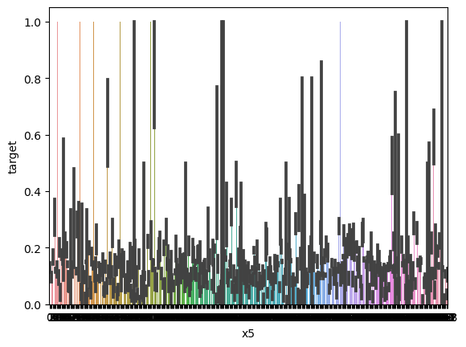

## 最初的Baseline

跑通结果 0.62684

#### 评分标准:F1-score

F1度量是查准率（Precision）和查全率（Recall）的调和平均数。
F1度量的计算公式如下：

$F1=\frac{2×P×R}{P+R​}$

F1能衡量机器学习算法性能。

什么,你不懂**查准率**和**查全率**?

#### 查准率

代表所有正例中有多少比例是真正例 $TP$

 $P=\frac{TP}{TP+FP}$

#### 查全率

代表样本里有多少正例被标记为真正例 $TP$

 $R=\frac{TP}{TP+FN}$

两者相互联系和制约,通常追求更高的**查准率**可能会牺牲**查全率**,反之亦然。

## 任务介绍

本次赛事的任务是基于讯飞开放平台提供的海量应用数据，构建一个模型来**预测用户的新增情况**。

```
***全是废话
具体来说，参赛选手需要分析这些应用数据中的用户使用场景，以及其他相关特征
然后利用机器学习或其他预测方法，创建一个模型，可以预测未来用户的增长情况。
这个任务旨在帮助讯飞开放平台了解用户增长趋势，为后续的产品和应用迭代升级提供指导和决策依据。
通过这个预测模型，可以更好地规划和优化产品和应用的发展策略。
```

预测该用户是否是**新增用户**，分类问题。

## 数据样本

- uuid: 样本唯一标识
- eid: 访问行为ID
- udfmap：行为属性，类似于 {"key3":"67804","key2":"484"} ，但也有可能为 unknown 其中的key1到key9表示不同的行为属性，如项目名、项目id等相关字段
- common_ts：应用访问记录发生时间（毫秒时间戳）
- x1-x8：未知字段，为1位到3位数字，未知用途，暂未找到逻辑
- target：判断是否为新增用户

### 代码分析

```py
train_data['common_ts'] = pd.to_datetime(train_data['common_ts'], unit='ms')
test_data['common_ts'] = pd.to_datetime(test_data['common_ts'], unit='ms')
```

数据集存在**时序信息**，进行时序计算处理。

```py
def udmap_onethot(d):
    v = np.zeros(9)
    if d == 'unknown':
        return v
    
    d = eval(d)
    for i in range(1, 10):
        if 'key' + str(i) in d:
            v[i-1] = d['key' + str(i)]
            
    return v

train_udmap_df = pd.DataFrame(np.vstack(train_data['udmap'].apply(udmap_onethot)))
test_udmap_df = pd.DataFrame(np.vstack(test_data['udmap'].apply(udmap_onethot)))

train_udmap_df.columns = ['key' + str(i) for i in range(1, 10)]
test_udmap_df.columns = ['key' + str(i) for i in range(1, 10)]
```

onehot函数执行的是特征工程，当udmap为unknown时，把x1-x8全部置零，这是为了什么？

```py
train_data = pd.concat([train_data, train_udmap_df], axis=1)
test_data = pd.concat([test_data, test_udmap_df], axis=1)
```

特征工程完成之后做进去

```py
train_data['eid_freq'] = train_data['eid'].map(train_data['eid'].value_counts())
test_data['eid_freq'] = test_data['eid'].map(train_data['eid'].value_counts())

train_data['eid_mean'] = train_data['eid'].map(train_data.groupby('eid')['target'].mean())
test_data['eid_mean'] = test_data['eid'].map(train_data.groupby('eid')['target'].mean())
```

这个特征工程统计的是访问行为ID的**频率**和**平均值**，把这个作为特征放了进去

```py
train_data['udmap_isunknown'] = (train_data['udmap'] == 'unknown').astype(int)
test_data['udmap_isunknown'] = (test_data['udmap'] == 'unknown').astype(int)
```

还是该死的unknown的特殊处理

```py
train_data['common_ts_hour'] = train_data['common_ts'].dt.hour
test_data['common_ts_hour'] = test_data['common_ts'].dt.hour
```

应用访问记录发生时间的“小时”也可以是特征么？

```py
import lightgbm as lgb
from sklearn.linear_model import LogisticRegression
from sklearn.tree import DecisionTreeClassifier

clf = DecisionTreeClassifier()
clf.fit(
    train_data.drop(['udmap', 'common_ts', 'uuid', 'target'], axis=1),
    train_data['target']
)
```

训练模型使用的是lightGBM，用的是**决策树**的训练方法？

什么，你不知道决策树，简单来说就是通过机器学习算法构建一个能够依据特征分类的树形结构啦。

## 数据分析和可视化

```py
import pandas as pd
import numpy as np
import matplotlib.pyplot as plt
import seaborn as sns

train_data = pd.read_csv('data/用户新增预测挑战赛公开数据/train.csv')
test_data = pd.read_csv('data/用户新增预测挑战赛公开数据/test.csv')

# 相关性热力图
sns.heatmap(train_data.drop(['udmap'],axis=1).corr().abs(), cmap='YlOrRd')
```


我发现**common_ts和x6**以及**x7和x8**两者的热力相关性非常高，很有必要对这两者继续做文章！

我们认为很有必要分析一下X1-X8到底有哪些取值，然后我们开始这么做了。

```py
sns.barplot(x='x1', y='target', data=train_data)
```
我们会做8次，从x1-x8，然后看看结果分别是什么？

#### X1-target


#### X2-target


#### X3-target


#### X4-target


#### X5-target



#### X6-target


#### X7-target


#### X8-target


- 字段x1至x8为用户相关的属性，为匿名处理字段。添加代码对这些数据字段的取值分析，那些字段为数值类型？那些字段为类别类型？

数值类型：
- x3
- x4
- x5
类别类型：
- x1
- x2
- x6
- x7
- x8

特殊的，X8我肯定它是**bool**类型的

这些图的细线代表的是误差条，关于误差条的说明在这里：https://zhuanlan.zhihu.com/p/584007819

在这里是95%的置信区间（Ci）

- 对common_ts提取小时后再尝试进行可视化：

```py
train_data['common_ts'] = pd.to_datetime(train_data['common_ts'], unit='ms')
train_data['common_ts_hour'] = train_data['common_ts'].dt.hour
sns.barplot(x='common_ts_hour', y='target', data=train_data)
```


初步推测在8-15点更有可能是新增用户。


尝试进行onehot之后，对标签进行匹配

```py
def udmap_onehot(d):
    v = np.zeros(9)
    if d == 'unknown' :
        return v
    
    d = eval(d)
    for i in range(1,10):
        if 'key' + str(i) in d:
            v[i-1] = d['key' + str(i)]

    return v

train_udmap_df = pd.DataFrame(np.vstack(train_data['udmap'].apply(udmap_onehot)))
train_udmap_df.columns = ['key' + str(i) for i in range(1,10)]
train_data = pd.concat([train_data, train_udmap_df], axis=1)
sns.barplot(x='key1', y='target', data=train_data)
```

从x1对target的情况如下：


不得不说特定值确实可以达到100%，但是看着很难分析到有效的信息？？？


## 交叉验证