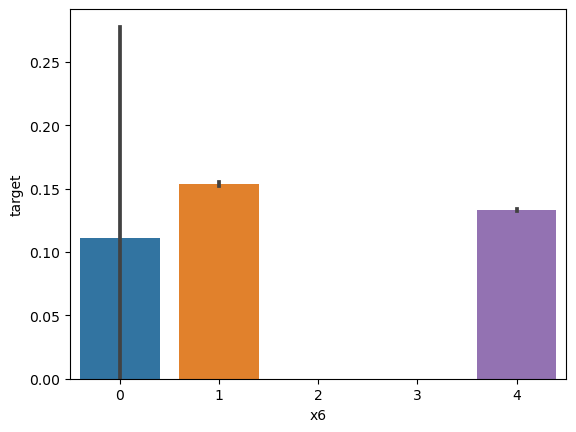

## 最初的Baseline

跑通结果 0.62684

#### 评分标准:F1-score

F1度量是查准率（Precision）和查全率（Recall）的调和平均数。
F1度量的计算公式如下：

$F1=\frac{2×P×R}{P+R​}$

F1能衡量机器学习算法性能。

什么,你不懂**查准率**和**查全率**?

#### 查准率

代表所有正例中有多少比例是真正例 $TP$

 $P=\frac{TP}{TP+FP}$

#### 查全率

代表样本里有多少正例被标记为真正例 $TP$

 $R=\frac{TP}{TP+FN}$

两者相互联系和制约,通常追求更高的**查准率**可能会牺牲**查全率**,反之亦然。

## 任务介绍

本次赛事的任务是基于讯飞开放平台提供的海量应用数据，构建一个模型来**预测用户的新增情况**。

```
***全是废话
具体来说，参赛选手需要分析这些应用数据中的用户使用场景，以及其他相关特征
然后利用机器学习或其他预测方法，创建一个模型，可以预测未来用户的增长情况。
这个任务旨在帮助讯飞开放平台了解用户增长趋势，为后续的产品和应用迭代升级提供指导和决策依据。
通过这个预测模型，可以更好地规划和优化产品和应用的发展策略。
```

预测该用户是否是**新增用户**，分类问题。

## 数据样本

- uuid: 样本唯一标识
- eid: 访问行为ID
- udfmap：行为属性，类似于 {"key3":"67804","key2":"484"} ，但也有可能为 unknown 其中的key1到key9表示不同的行为属性，如项目名、项目id等相关字段
- common_ts：应用访问记录发生时间（毫秒时间戳）
- x1-x8：未知字段，为1位到3位数字，未知用途，暂未找到逻辑
- target：判断是否为新增用户

### 代码分析

```py
train_data['common_ts'] = pd.to_datetime(train_data['common_ts'], unit='ms')
test_data['common_ts'] = pd.to_datetime(test_data['common_ts'], unit='ms')
```

数据集存在**时序信息**，进行时序计算处理。

```py
def udmap_onethot(d):
    v = np.zeros(9)
    if d == 'unknown':
        return v
    
    d = eval(d)
    for i in range(1, 10):
        if 'key' + str(i) in d:
            v[i-1] = d['key' + str(i)]
            
    return v

train_udmap_df = pd.DataFrame(np.vstack(train_data['udmap'].apply(udmap_onethot)))
test_udmap_df = pd.DataFrame(np.vstack(test_data['udmap'].apply(udmap_onethot)))

train_udmap_df.columns = ['key' + str(i) for i in range(1, 10)]
test_udmap_df.columns = ['key' + str(i) for i in range(1, 10)]
```

onehot函数执行的是特征工程，当udmap为unknown时，把x1-x8全部置零，这是为了什么？

```py
train_data = pd.concat([train_data, train_udmap_df], axis=1)
test_data = pd.concat([test_data, test_udmap_df], axis=1)
```

特征工程完成之后做进去

```py
train_data['eid_freq'] = train_data['eid'].map(train_data['eid'].value_counts())
test_data['eid_freq'] = test_data['eid'].map(train_data['eid'].value_counts())

train_data['eid_mean'] = train_data['eid'].map(train_data.groupby('eid')['target'].mean())
test_data['eid_mean'] = test_data['eid'].map(train_data.groupby('eid')['target'].mean())
```

这个特征工程统计的是访问行为ID的**频率**和**平均值**，把这个作为特征放了进去

```py
train_data['udmap_isunknown'] = (train_data['udmap'] == 'unknown').astype(int)
test_data['udmap_isunknown'] = (test_data['udmap'] == 'unknown').astype(int)
```

还是该死的unknown的特殊处理

```py
train_data['common_ts_hour'] = train_data['common_ts'].dt.hour
test_data['common_ts_hour'] = test_data['common_ts'].dt.hour
```

应用访问记录发生时间的“小时”也可以是特征么？

```py
import lightgbm as lgb
from sklearn.linear_model import LogisticRegression
from sklearn.tree import DecisionTreeClassifier

clf = DecisionTreeClassifier()
clf.fit(
    train_data.drop(['udmap', 'common_ts', 'uuid', 'target'], axis=1),
    train_data['target']
)
```

训练模型使用的是lightGBM，用的是**决策树**的训练方法？

什么，你不知道决策树，简单来说就是通过机器学习算法构建一个能够依据特征分类的树形结构啦。

## 数据分析和可视化

```py
import pandas as pd
import numpy as np
import matplotlib.pyplot as plt
import seaborn as sns

train_data = pd.read_csv('data/用户新增预测挑战赛公开数据/train.csv')
test_data = pd.read_csv('data/用户新增预测挑战赛公开数据/test.csv')

# 相关性热力图
sns.heatmap(train_data.drop(['udmap'],axis=1).corr().abs(), cmap='YlOrRd')
```


我发现**common_ts和x6**以及**x7和x8**两者的热力相关性非常高，很有必要对这两者继续做文章！

我们认为很有必要分析一下X1-X8到底有哪些取值，然后我们开始这么做了。

```py
sns.barplot(x='x1', y='target', data=train_data)
```
我们会做8次，从x1-x8，然后看看结果分别是什么？

#### X1-target


#### X2-target


#### X3-target


#### X4-target


#### X5-target


#### X6-target



#### X7-target


#### X8-target


- 字段x1至x8为用户相关的属性，为匿名处理字段。添加代码对这些数据字段的取值分析，那些字段为数值类型？那些字段为类别类型？

数值类型：
- x3
- x4
- x5
类别类型：
- x1
- x2
- x6
- x7
- x8

特殊的，X8我肯定它是**bool**类型的

这些图的细线代表的是误差条，关于误差条的说明在这里：https://zhuanlan.zhihu.com/p/584007819

在这里是95%的置信区间（Ci）

- 对common_ts提取小时后再尝试进行可视化：

```py
train_data['common_ts'] = pd.to_datetime(train_data['common_ts'], unit='ms')
train_data['common_ts_hour'] = train_data['common_ts'].dt.hour
sns.barplot(x='common_ts_hour', y='target', data=train_data)
```


初步推测在8-15点更有可能是新增用户。


尝试进行onehot之后，对标签进行匹配

```py
def udmap_onehot(d):
    v = np.zeros(9)
    if d == 'unknown' :
        return v
    
    d = eval(d)
    for i in range(1,10):
        if 'key' + str(i) in d:
            v[i-1] = d['key' + str(i)]

    return v

train_udmap_df = pd.DataFrame(np.vstack(train_data['udmap'].apply(udmap_onehot)))
train_udmap_df.columns = ['key' + str(i) for i in range(1,10)]
train_data = pd.concat([train_data, train_udmap_df], axis=1)
sns.barplot(x='key1', y='target', data=train_data)
```

从x1对target的情况如下：


不得不说特定值确实可以达到100%，但是看着很难分析到有效的信息？？？


## 交叉验证

通过交叉验证的方法来评判哪个方法更适合模型。

```py
# 训练并验证SGDClassifier
pred = cross_val_predict(
    SGDClassifier(max_iter=10),
    train_data.drop(['udmap', 'common_ts', 'uuid', 'target'], axis=1),
    train_data['target']
)
print(classification_report(train_data['target'], pred, digits=3))

# 训练并验证DecisionTreeClassifier
pred = cross_val_predict(
    DecisionTreeClassifier(),
    train_data.drop(['udmap', 'common_ts', 'uuid', 'target'], axis=1),
    train_data['target']
)
print(classification_report(train_data['target'], pred, digits=3))

# 训练并验证MultinomialNB
pred = cross_val_predict(
    MultinomialNB(),
    train_data.drop(['udmap', 'common_ts', 'uuid', 'target'], axis=1),
    train_data['target']
)
print(classification_report(train_data['target'], pred, digits=3))

# 训练并验证RandomForestClassifier
pred = cross_val_predict(
    RandomForestClassifier(n_estimators=5),
    train_data.drop(['udmap', 'common_ts', 'uuid', 'target'], axis=1),
    train_data['target']
)
print(classification_report(train_data['target'], pred, digits=3))
```
介绍四个模型：
- **SGDClassifier** (Stochastic Gradient Descent Classifier):
这是使用随机梯度下降（SGD）进行训练的线性分类器。它是一种在线学习算法，适用于大规模数据集。max_iter参数定义了SGD算法的迭代次数，它决定了模型训练的周期数。
- **DecisionTreeClassifier**:
决策树分类器是一种基于树结构的分类模型。它将特征空间划分为多个子空间，并在每个子空间中进行预测。模型会通过学习数据中的特征关系来构建决策树，从而进行分类。
- **MultinomialNB** (Multinomial Naive Bayes):
多项式朴素贝叶斯分类器是一种基于贝叶斯定理的分类模型，适用于文本分类等问题。它假设特征之间是条件独立的，并使用多项式分布来处理多类别问题，如文本分类中的多个类别。
- **RandomForestClassifier**:
随机森林分类器是基于决策树的集成学习模型。它通过构建多个决策树并进行投票或平均来进行分类。n_estimators参数定义了随机森林中决策树的数量，它越大通常意味着模型具有更强的鲁棒性和准确性。


四个模型的训练结果为：

```
              precision    recall  f1-score   support

           0      0.867     0.764     0.812    533155
           1      0.163     0.282     0.207     87201

    accuracy                          0.696    620356
   macro avg      0.515     0.523     0.509    620356
weighted avg      0.768     0.696     0.727    620356

              precision    recall  f1-score   support

           0      0.934     0.940     0.937    533155
           1      0.618     0.593     0.605     87201

    accuracy                          0.891    620356
   macro avg      0.776     0.766     0.771    620356
weighted avg      0.889     0.891     0.890    620356

              precision    recall  f1-score   support

           0      0.893     0.736     0.807    533155
           1      0.221     0.458     0.298     87201

    accuracy                          0.697    620356
   macro avg      0.557     0.597     0.552    620356
weighted avg      0.798     0.697     0.735    620356

              precision    recall  f1-score   support

           0      0.921     0.955     0.938    533155
           1      0.644     0.502     0.564     87201

    accuracy                          0.891    620356
   macro avg      0.782     0.728     0.751    620356
weighted avg      0.882     0.891     0.885    620356
```

综合评价下来，**决策树**和**随机森林**都是很不错的方案，而决策树略胜于随机森林。

我并不知道除了上述的模型，还可以继续尝试哪些模型，我想很有必要继续做特征工程来为训练助力了。

### 特征工程

我们决定为giki学习增加新的特征

在原先的代码中间添加

- 时间特征：天（之前已有小时）
- x1-x8的频次和均值

```py
## extra FP
train_data['common_ts_day'] = train_data['common_ts'].dt.day
test_data['common_ts_day'] = test_data['common_ts'].dt.day

train_data['x1_freq'] = train_data['x1'].map(train_data['x1'].value_counts())
test_data['x1_freq'] = test_data['x1'].map(train_data['x1'].value_counts())
train_data['x1_mean'] = train_data['x1'].map(train_data.groupby('x1')['target'].mean())
test_data['x1_mean'] = test_data['x1'].map(train_data.groupby('x1')['target'].mean())

train_data['x2_freq'] = train_data['x2'].map(train_data['x2'].value_counts())
test_data['x2_freq'] = test_data['x2'].map(train_data['x2'].value_counts())
train_data['x2_mean'] = train_data['x2'].map(train_data.groupby('x2')['target'].mean())
test_data['x2_mean'] = test_data['x2'].map(train_data.groupby('x2')['target'].mean())

train_data['x3_freq'] = train_data['x3'].map(train_data['x3'].value_counts())
test_data['x3_freq'] = test_data['x3'].map(train_data['x3'].value_counts())

train_data['x4_freq'] = train_data['x4'].map(train_data['x4'].value_counts())
test_data['x4_freq'] = test_data['x4'].map(train_data['x4'].value_counts())

train_data['x6_freq'] = train_data['x6'].map(train_data['x6'].value_counts())
test_data['x6_freq'] = test_data['x6'].map(train_data['x6'].value_counts())
train_data['x6_mean'] = train_data['x6'].map(train_data.groupby('x6')['target'].mean())
test_data['x6_mean'] = test_data['x6'].map(train_data.groupby('x6')['target'].mean())

train_data['x7_freq'] = train_data['x7'].map(train_data['x7'].value_counts())
test_data['x7_freq'] = test_data['x7'].map(train_data['x7'].value_counts())
train_data['x7_mean'] = train_data['x7'].map(train_data.groupby('x7')['target'].mean())
test_data['x7_mean'] = test_data['x7'].map(train_data.groupby('x7')['target'].mean())

train_data['x8_freq'] = train_data['x8'].map(train_data['x8'].value_counts())
test_data['x8_freq'] = test_data['x8'].map(train_data['x8'].value_counts())
train_data['x8_mean'] = train_data['x8'].map(train_data.groupby('x8')['target'].mean())
test_data['x8_mean'] = test_data['x8'].map(train_data.groupby('x8')['target'].mean())
```

继续上述模型交叉验证训练，得出结果：

```
              precision    recall  f1-score   support

           0      0.863     0.783     0.821    533155
           1      0.154     0.241     0.188     87201

    accuracy                          0.707    620356
   macro avg      0.508     0.512     0.504    620356
weighted avg      0.763     0.707     0.732    620356

              precision    recall  f1-score   support

           0      0.955     0.951     0.953    533155
           1      0.707     0.725     0.716     87201

    accuracy                          0.919    620356
   macro avg      0.831     0.838     0.834    620356
weighted avg      0.920     0.919     0.920    620356

              precision    recall  f1-score   support

           0      0.915     0.499     0.646    533155
           1      0.190     0.718     0.300     87201

    accuracy                          0.530    620356
   macro avg      0.553     0.608     0.473    620356
weighted avg      0.813     0.530     0.597    620356

              precision    recall  f1-score   support

           0      0.938     0.965     0.951    533155
           1      0.738     0.609     0.668     87201

    accuracy                          0.915    620356
   macro avg      0.838     0.787     0.809    620356
weighted avg      0.910     0.915     0.911    620356
```

总体来说绝大部分的成绩都得到了不错的提升，尤其是决策树和随机森林，准确度甚至可以达到 89.1%，但是很有必要做的一件事情是：测试增加了特征工程继续跑baseline后的表现又是如何？

我们决定继续用决策树，它相比对于之前没有任何变化。

```py
from sklearn.tree import DecisionTreeClassifier

clf = DecisionTreeClassifier()
clf.fit(
    train_data.drop(['udmap','common_ts','uuid','target'],axis=1),
    train_data['target']
)
DecisionTreeClassifier(ccp_alpha=0.0, class_weight=None, criterion='gini',
                       max_depth=None, max_features=None, max_leaf_nodes=None,
                       min_impurity_decrease=0.0, 
                       min_samples_leaf=1, min_samples_split=2,
                       min_weight_fraction_leaf=0.0,
                       random_state=None, splitter='best')

pd.DataFrame({
    'uuid': test_data['uuid'],
    'target': clf.predict(test_data.drop(['udmap','common_ts','uuid'],axis=1))
}).to_csv('submit.csv',index=None)
```

但是发现直接跑报错，因为有nan的存在，因此我决定注释掉一些特征工程语句，来判断哪里出现了问题

没问题的语句

```py
train_data['common_ts_day'] = train_data['common_ts'].dt.day
test_data['common_ts_day'] = test_data['common_ts'].dt.day

train_data['x1_freq'] = train_data['x1'].map(train_data['x1'].value_counts())
test_data['x1_freq'] = test_data['x1'].map(train_data['x1'].value_counts())
train_data['x1_mean'] = train_data['x1'].map(train_data.groupby('x1')['target'].mean())
test_data['x1_mean'] = test_data['x1'].map(train_data.groupby('x1')['target'].mean())

train_data['x2_freq'] = train_data['x2'].map(train_data['x2'].value_counts())
test_data['x2_freq'] = test_data['x2'].map(train_data['x2'].value_counts())
train_data['x2_mean'] = train_data['x2'].map(train_data.groupby('x2')['target'].mean())
test_data['x2_mean'] = test_data['x2'].map(train_data.groupby('x2')['target'].mean())

train_data['x6_freq'] = train_data['x6'].map(train_data['x6'].value_counts())
test_data['x6_freq'] = test_data['x6'].map(train_data['x6'].value_counts())
train_data['x6_mean'] = train_data['x6'].map(train_data.groupby('x6')['target'].mean())
test_data['x6_mean'] = test_data['x6'].map(train_data.groupby('x6')['target'].mean())

train_data['x7_freq'] = train_data['x7'].map(train_data['x7'].value_counts())
test_data['x7_freq'] = test_data['x7'].map(train_data['x7'].value_counts())
train_data['x7_mean'] = train_data['x7'].map(train_data.groupby('x7')['target'].mean())
test_data['x7_mean'] = test_data['x7'].map(train_data.groupby('x7')['target'].mean())

train_data['x8_freq'] = train_data['x8'].map(train_data['x8'].value_counts())
test_data['x8_freq'] = test_data['x8'].map(train_data['x8'].value_counts())
train_data['x8_mean'] = train_data['x8'].map(train_data.groupby('x8')['target'].mean())
test_data['x8_mean'] = test_data['x8'].map(train_data.groupby('x8')['target'].mean())

```

有问题的语句，需要注释掉，可能这些特征产生了NAN值

```py
train_data['x3_freq'] = train_data['x3'].map(train_data['x3'].value_counts())
test_data['x3_freq'] = test_data['x3'].map(train_data['x3'].value_counts())

train_data['x4_freq'] = train_data['x4'].map(train_data['x4'].value_counts())
test_data['x4_freq'] = test_data['x4'].map(train_data['x4'].value_counts())
```

尝试继续跑baseline，得到的结果是：

**0.73378** > 0.62684

一个良好的特征工程确实能够有效提升得分，尽管可能还不够。